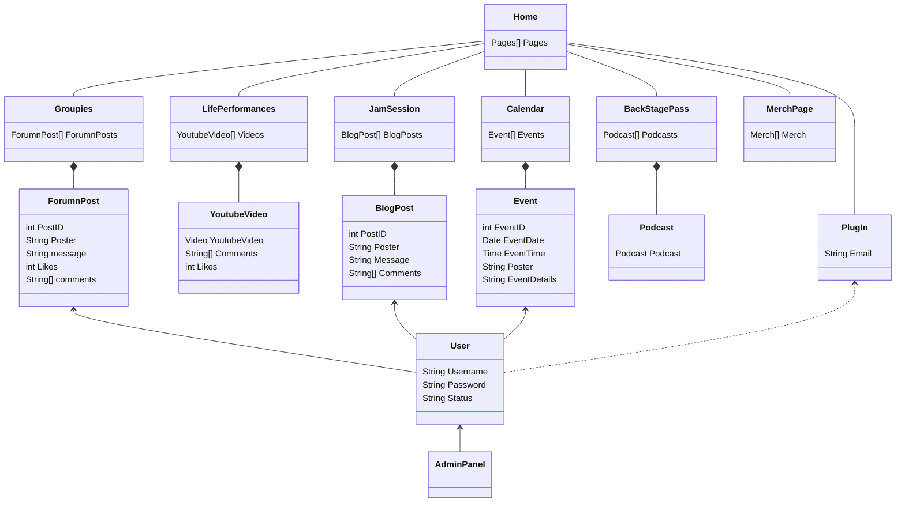

* Home - The home page for the website, This page will contain the links for all of the other pages.  
* Groupies - This page will contain the forumn for people to communicate with one another. Therefore it will need a list of the forumn posts
  * ForumnPosts - This will contain a string of the post itself, an ID corresponding with the post, A string telling the username of the poster, A count of the likes, and a list of strings for comments.
* LifePerformances - This page will contain Youtube videos and an in website like and comment system. Therefore it will need a list of the YoutubeVideo class.
  * YoutubeVideo - A call to the Youtube api that gets and returns an instance of a Youtube video, This also holds an in website like and comments that need a list of strings and an integer respectively.
* JamSession - This page contains the blog page so it will consist of a list of instances of the blog post class.
  * BlogPosts - Contains a long string with the message of the post. Also contains the username of the poster, an id corresponding with the post, and the comments on that post
* Calendar - This page will contain a calendar that will have events inside of it.
  * Event - An event will contain the event details, date, time, poster, and an Id that goes along with it.
* BackStagePass - This page will contain a list of podcasts.
  * Podcast - A call to the api of the service that the podcast is hosted on, i.e. Spotify, Soundcloud, etc. 
* MerchPage - This page will involve a call to an api of an undetermined merch company.
* PlugIn - This page lets the user input an email to sign up for the newsletter, If that email corresponds with a user that should be tracked.
* User - The basic information that identifies individual users. This includes the UserName, Password, and the status of the user, the status is what determines if a user is an admin or not.
* AdminPanel - A panel that includes various admin and moderation tasks. Including but not limited to, banning users, approving requests, and promoting users to admins. The user must have the admin status to be able to use this.
